# Shadering

A collection of self-contained generative-art and shader studies. Every study is a
single standalone HTML file — no build step, no framework, no dependencies. Open it
in a browser and it runs.

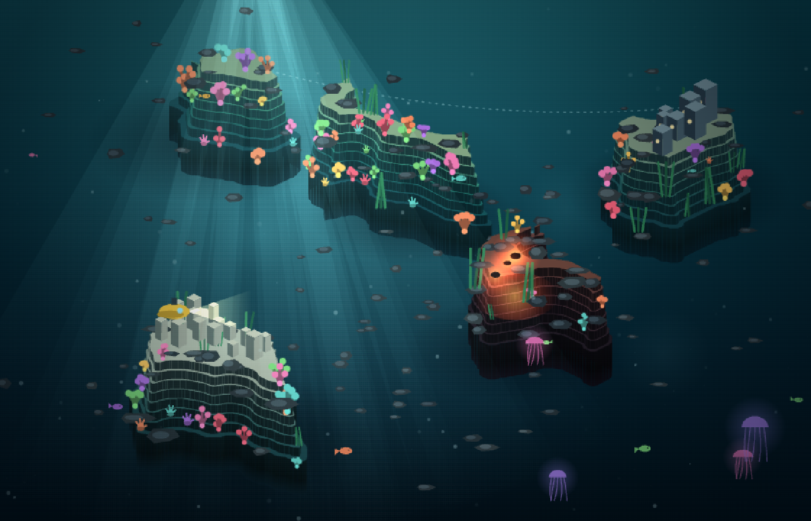

## Studies

### Reef — procedural underwater islands ([reef-islands.html](reef-islands.html))

A seed-deterministic Canvas 2D generator for stylized underwater isometric islands:
stepped terraces, coral and kelp props, drifting fish and jellyfish, god rays, and
distance haze. Island archetypes (volcanic, ruins, round reef, …), island count,
prop density, and seed are all configurable from the in-page UI.

| Volcanic | Round reef |
|---|---|
| 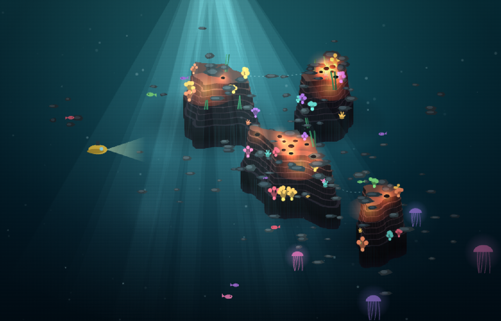 | 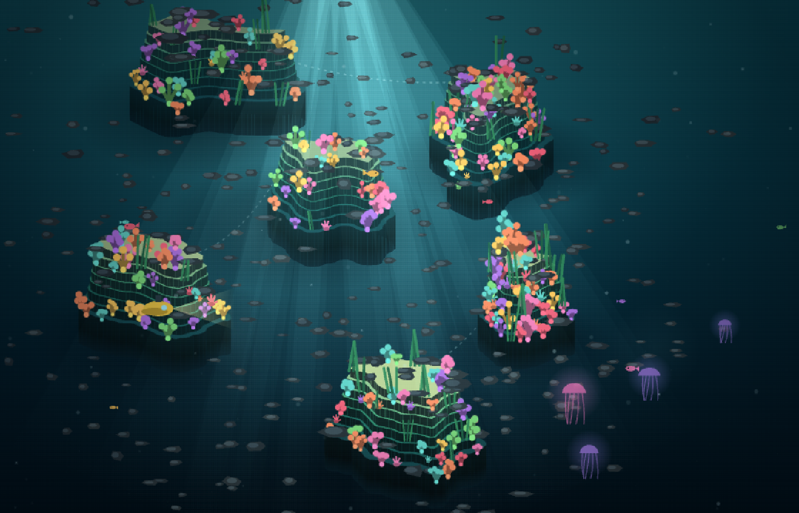 |

### Nautilus — agents under the sea ([nautilus-agents.html](nautilus-agents.html))

A pixel-art explainer of agent orchestration in the style of *Twenty Thousand Leagues
Under the Sea*. The Nautilus is the orchestrator; brass-helmeted divers are
sub-agents that leave the airlock with a fresh context and one narrow job. They read
the **sunken library** (knowledge base), recall from the **giant pearl** (memory),
search and carve the stone tablets of **Atlantis** (the repository, one tablet per
file) and read the coin stacks of the **Vigo Bay wreck** (git history). Four voyages
walk through survey → plan → build → verify → merge; a failing test rises as the
**kraken** and has to be harpooned, fixed and re-run. The captain's log, live diffs,
test output, Conseil's plan and a context ledger (tokens read by the crew vs. held by
the orchestrator) update alongside the scene. Hover anything on the canvas for what it
stands for; `?voyage=3` starts at a later voyage and `?at=60` fast-forwards.

Its sprites come from the [sprite pipeline](#sprite-pipeline) below.

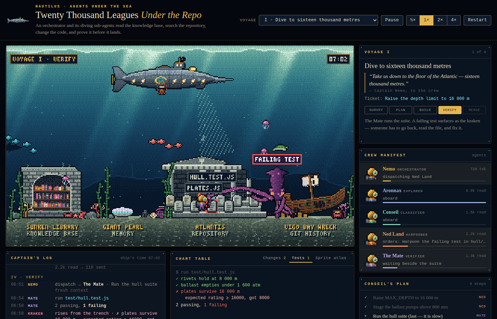

### Nautilus OS — agent orchestration console ([nautilus-os.html](nautilus-os.html))

The same idea as an operations console, seen from above. The map is painted rather
than dithered: open water with layers of karst massifs in the mist (clusters of
pinnacles and mesas, lit along their crests, a rare ruin on top), a rolling sea floor
of silt and rock outcrops coming out of the haze, drowned ruins, coral and a kelp
forest at both edges, and a floating island under every station, its rock hanging
in stalactites. Colours
mix in RGB, so gradients stay soft, and texture comes from clustered noise instead of
a Bayer matrix. The orchestrator's keep sits in the middle with a great globe turning in its
bronze cradle; seven stations float around it, each its own kind of place: the
Knowledge Base a library hall open on lamplit shelves, Documents a plaza of runes
where open books float in a column of light, the Model Registry a glass tank with a
hologram whale and floating screens, Repositories a container depot under a crane
with smoking stacks, the Testing Lab a glass sphere with a glowing core in orbit
rings, Memory a dome with a violet brain whose synapses spark, and Deployments a dry
dock with a submarine under a portal crane. All in aged, patinated metal, dark
bronze and old glass the sea shows through. Routes of glowing beads join them to the
hub. A half-resolution glow layer, screened over the pixels, lights the
domes, lamps, routes, submarines and bioluminescence; god rays fan down from the
surface, a ghostly whale and octopus drift at the top of the map, and the bridge in
the corner flickers by lamplight. Seven
submarine agents (Aronnax, Conseil, Ned Land, Cyrus Smith, Lidenbrock, Barbicane and
Axel) travel the routes, and each station's card updates as they read, write, train,
test and deploy. Three projects run research → analyze → build → test → deploy, with a
kraken rising at the Testing Lab when a suite fails. The dock shows active agents,
recent activity with live diffs and test output, voyage progress with a context
ledger, and a minimap. Click a station or an agent for detail; `?project=2` starts at
a later project and `?at=60` fast-forwards. On phones the map pans sideways.

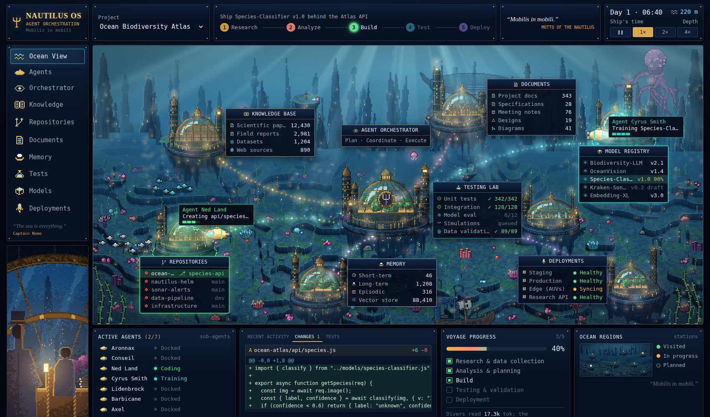

### Hortus OS — the console as a garden at dusk ([hortus-os.html](hortus-os.html))

The same orchestration run in a walled garden at the end of a summer day. The sky
fades from gold to lavender over hills with a village and a backlit wood; the
meadow rolls in evening shade, gravel paths follow the routes, and a garden wall
with a door closes the view. Each station stands on a round plot inside a
dry-stone wall: the Knowledge Base a thatched seed library with a smoking chimney,
Documents a glasshouse herbarium, the Model Registry a topiary garden, Repositories
an apiary of painted hives in lavender, the Testing Lab a nursery of seedlings
under cloches, Memory a lily pond with koi and a stone lantern, and Deployments a
windmill whose sails turn. The Great Oak in the middle, a treehouse in its crown,
is the orchestrator. Seven bumblebees with lanterns (Mary, Colin, Dickon, Martha,
Susan, Robin and Soot) fly the routes; butterflies, birds, fireflies and drifting
seeds fill the air, and the villain is a bramble that climbs out of the nursery
when a suite fails. The header reads the temperature; the three projects are a
Pollinator Census, Frost Guard (the night falls from 6 °C to −4 °C) and a bramble
early warning. In the corner, Weatherstaff and Mary talk in the potting shed.

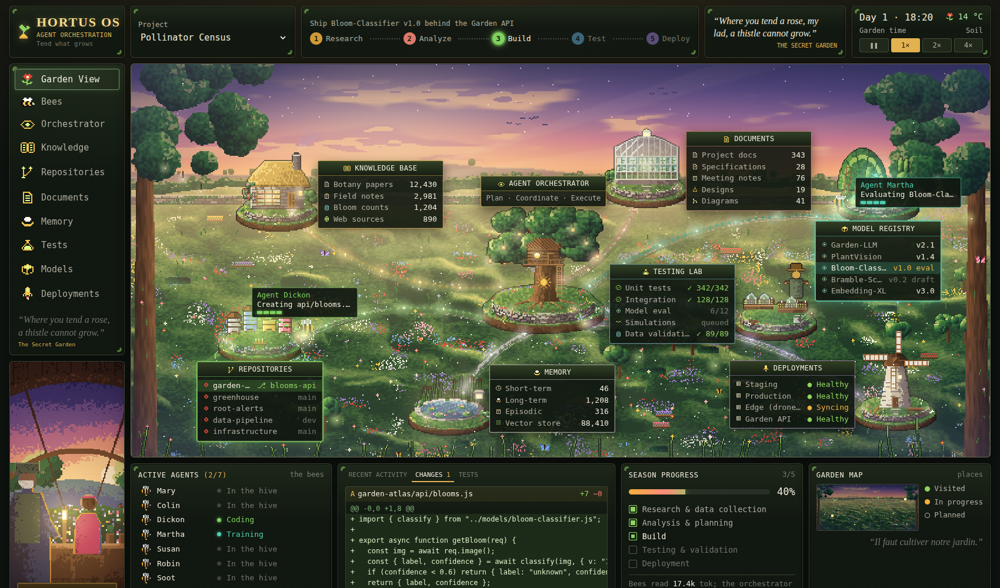

### NEON//OS — the console as a cyberpunk city ([neon-os.html](neon-os.html))

The same run once more, over a megacity at midnight in the rain. Three ranks of
towers sink into magenta smog, with vertical signs and a spire's red light here
and there; below them lies a dark grid of blocks, with sodium lamps along the
streets and the light trails of the traffic. Searchlights sweep the sky, a blimp
crosses with an advert, a hologram koi the size of a building drifts through, and
three lanes of hover traffic fly above the roofs. The stations stand on city
blocks: the Knowledge Base a data archive with blinking racks, Documents a holo
kiosk with floating papers, the Model Registry an AI lab with a hologram head on
its roof, Repositories container homes under a crane, the Testing Lab a bunker
under a hexagonal force field, Memory a neon pagoda with holo koi, and Deployments
a skyport with a VTOL. The orchestrator is an arcology with a wireframe globe on
its crown. Seven hover cars (Kade, Nyx, Juno, Rook, Vex, Sable and Echo) are the
agents, and ICE, a black mask with red eyes, rises over the firewall when a test
fails. The header shows the Maglev's speed; the projects are a Night Market
Translator, Maglev 600 (400 → 600 km/h) and an ICE early warning. In the corner a
hacker works at three screens while the rain runs down the window.

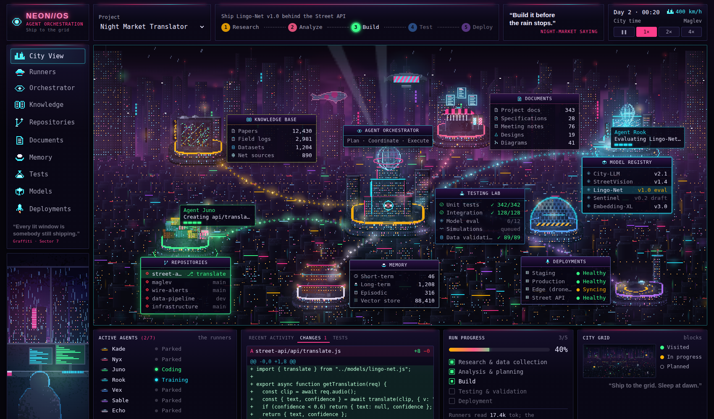

### NEON variants — the same city in 3D and side-on, each in high fidelity and in pixels

Four more consoles run NEON//OS's story over the city drawn four other ways. The
story lives in [assets/neon/story.js](assets/neon/story.js): the runners, the
blocks, the three projects with their orders, edits and test runs, and the city's
own words. neon-os.html uses the same file.

| Page | View | How it is drawn |
|---|---|---|
| [neon-3d.html](neon-3d.html) | 3D, high fidelity | three.js: bloom, wet streets that mirror the neon, a colour grade, glass panels and line icons |
| [neon-3d-pixel.html](neon-3d-pixel.html) | 3D, pixel | the same scene rendered at the map's art resolution, outlined by depth and reduced to the NEON palette, with no dithering |
| [neon-2d.html](neon-2d.html) | side-on, high fidelity | vectors at the screen's own resolution: gradients, soft light, smoke |
| [neon-2d-pixel.html](neon-2d-pixel.html) | side-on, pixel | painted pixel by pixel, with the blocks as sprites |

**3D** ([assets/neon/city3d.js](assets/neon/city3d.js)): a district plate seen from
high above and far off, with its street grid turned against the view. The blocks,
buildings and cars keep their size while every distance in the layout grows, so a
great deal of city fits between them. The pixel page renders on a finer map (520
art pixels high) to keep its detail. The eight blocks are built
in geometry: the arcology with a wireframe globe, a data archive with blinking
racks, a holo kiosk with floating documents, an AI lab with a hologram head, container
stacks under a crane, a firewall dome, a pagoda circled by koi, and a skyport.
Past the plate's edge, megatowers fall away into smog lit from below. The runners
are hover cars cut from the pixel sprite's profile. ICE climbs out of the firewall,
and the corner shows a CCTV feed from a street corner beside the arcology. The engine still runs
the scenario on its flat map: that map is the screen of a fixed camera, and every
route, runner and speck is cast onto the plane the routes fly on. three.js 0.186.1
loads from cdn.jsdelivr.net through an import map, so these two pages need a network
connection.

**Side-on** ([assets/neon/skyline.js](assets/neon/skyline.js) is the shared plan):
the city from far off, on a map 560 art pixels high. Colossal towers stand at the back
in the smog under a drowned moon. In front of them are four ranks of towers, and they
are not clean:
- rain streaks and rust running down from the sills, pipes, air-conditioners dripping,
  and fire escapes;
- water tanks, dishes and billboards on the roofs;
- neon signs with dead letters;
- skybridges between towers, and a tangle of cables, some hung with washing.

Low cloud lies between the ranks, and holograms hang over the middle distance. Smoke
rises from the roofs, and the low air is lit orange by the sodium lamps. Each block
stands on a grimy tower of its own, and neon arcs join the decks. A highway and the
maglev cross the city. On the street, shops glow under striped awnings, cars pass and
people walk under umbrellas, and the wet asphalt holds it all upside down. ICE climbs
the Testing Lab's tower out of the street. The pixel page draws the blocks from
`assets/neon/src/side.mjs`; the high-fidelity page draws the same plan as vectors.

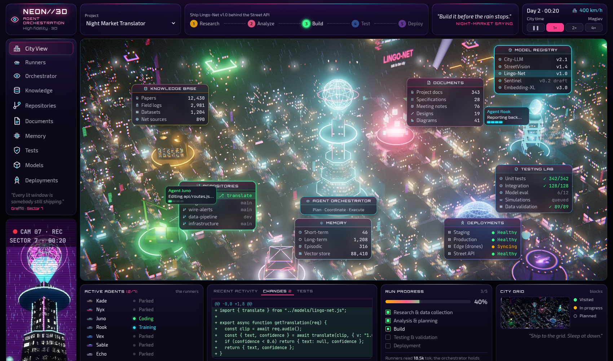
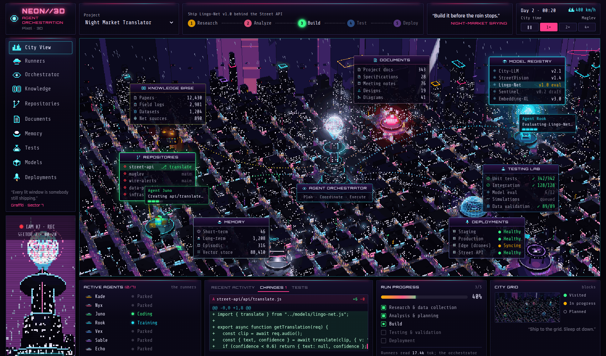
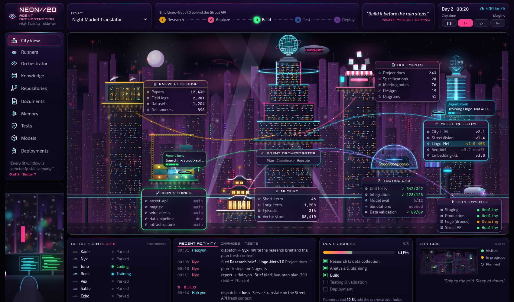
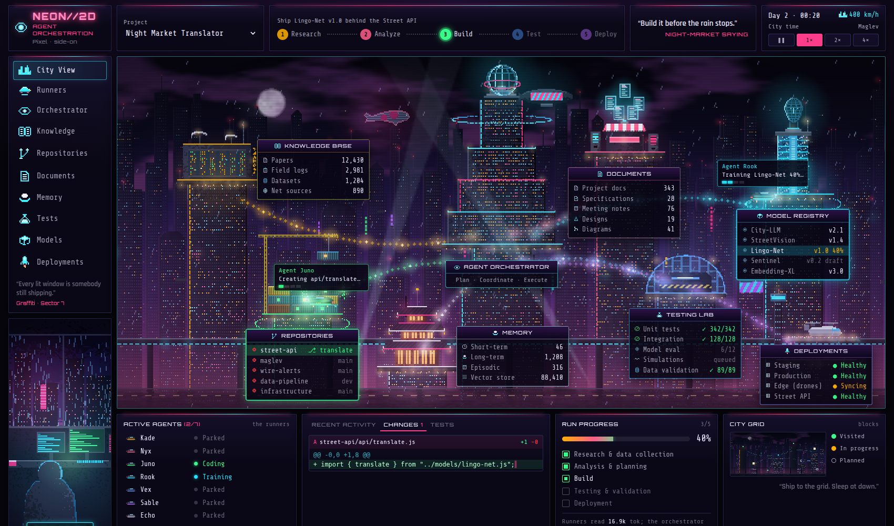

All three consoles share one engine, [assets/os/engine.js](assets/os/engine.js), and
one stylesheet, [assets/os/os.css](assets/os/os.css). The engine owns the layout,
the cards, the agents' routes, the director that runs the projects, the villain's
state and the dock; each page brings its own world. It supplies data (stations,
agents, projects, texts) plus hooks that paint the static map, draw the agents and
the villain, add ambient life and decorate the chrome, then calls `startOS(world)`.
The stylesheet is themed through CSS variables, so every page restyles it with a
short `<style>` block.

A world can ask for a finer map with `mapH`: its art pixels are then smaller, so
the city is seen from further off. A world can also do without sprites for its stations. `placeStation(s)` then sizes
each station itself; the 3D and vector consoles use it. The high-fidelity consoles
swap the atlas's pixel icons for line drawings from
[assets/os/hifi-icons.js](assets/os/hifi-icons.js).

### Aqua — 16-bit underwater study ([aqua-16bit.html](aqua-16bit.html))

A WebGL fragment-shader scene in a retro 16-bit palette: radial sun shafts from a
single source, ordered dithering, drifting particles, and a warm seafloor glow.


### Nine — nine ways to draw a cosmic web ([nine-cosmic-webs.html](nine-cosmic-webs.html))

One reference plate — an orange-violet cellular tessellation cut by a
horizon-grazing beam — recreated nine times as procedural fragment shaders.
Same palette, same composition, nine different mathematical paths to get there.

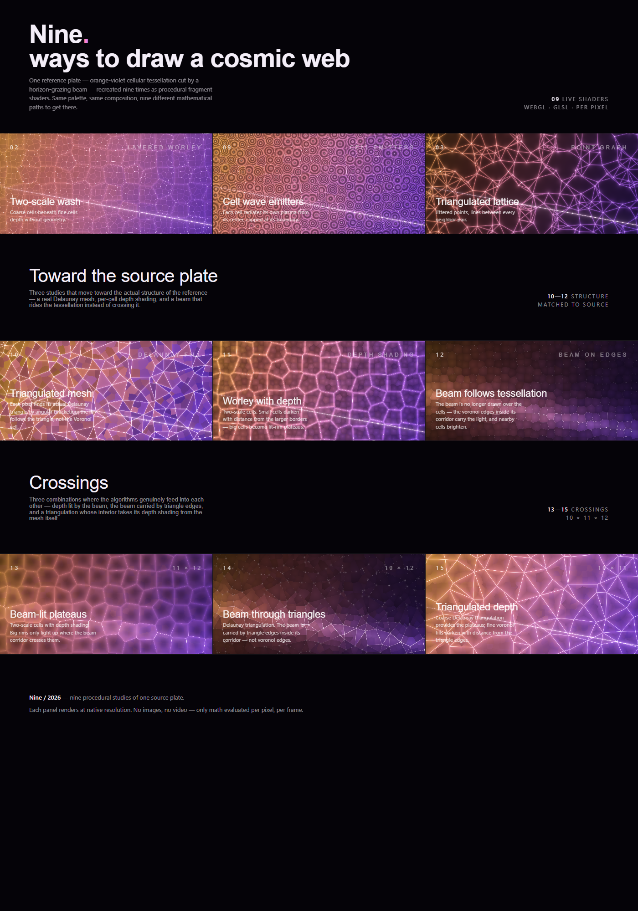

### Cosmic Filament — clustered knowledge graph ([cosmic-filament.html](cosmic-filament.html))

A knowledge graph rendered as a cosmic web: clusters tinted per region, nodes as
stars, edges as filaments. The renderer lives in
[cosmic-filament.js](cosmic-filament.js) as a reusable ES module, so this is the
one study that needs a local HTTP server (see below).

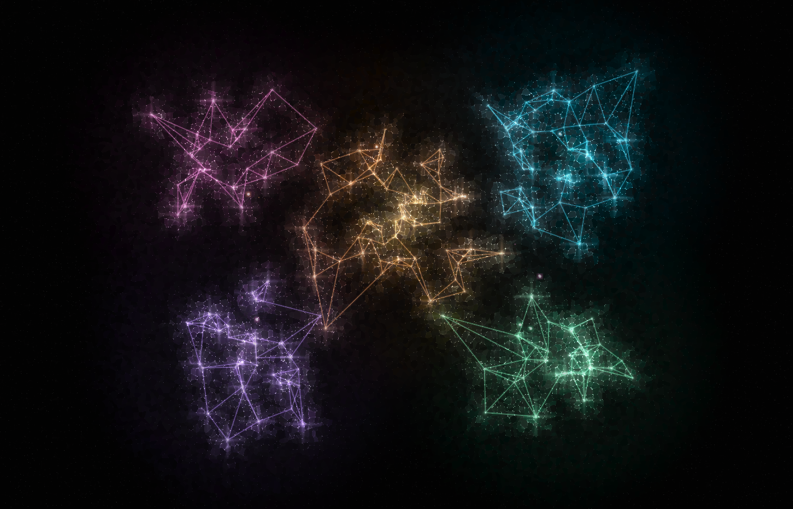

### Colors — caustic study, HDR pipeline ([caustic-hdr.html](caustic-hdr.html))

Luminance pattern first; color is a transformation; HDR runs hot until the final
tone map. Gradient endpoints, heightmap shaping, and cell/warp parameters are all
tweakable live.

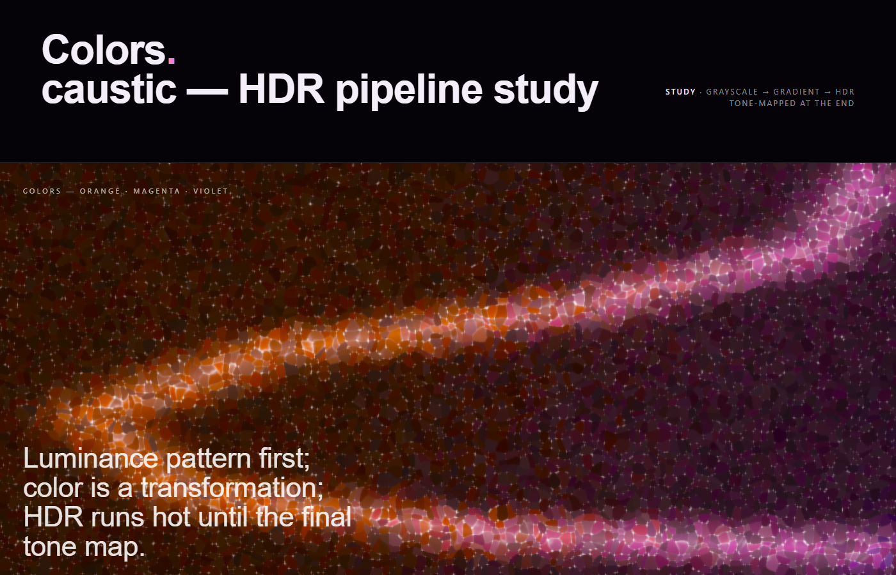

### POC — constellation as heightmap, caustic below ([constellation-caustic.html](constellation-caustic.html))

A multi-pass experiment: a constellation drives a heightmap, which drives a caustic
layer underneath; the composite blend is adjustable per layer.

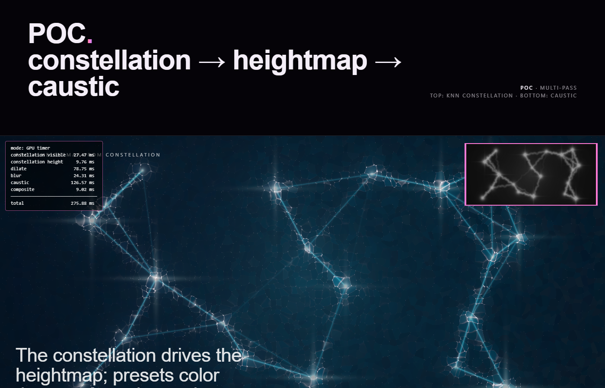

### Playground ([index.html](index.html))

A landing page with three live cosmic-web studies — triangulated Voronoi cells,
filled Voronoi with a beam, and a hand-placed constellation.

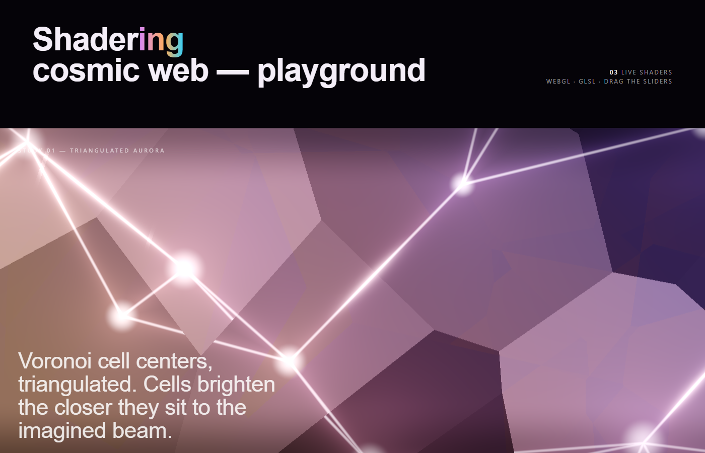

## Running

Open any `.html` file directly in a browser — everything is self-contained.

`nautilus-agents.html` and `nautilus-os.html` load their sprite atlas from
`assets/nautilus/atlas.js`, `hortus-os.html` from `assets/garden/atlas.js` and
`neon-os.html` and its four variants from `assets/neon/atlas.js`. The consoles also
load `assets/os/engine.js` and `assets/os/os.css`. All of these are plain script and
link tags, so the pages still work from `file://`. `neon-3d.html` and
`neon-3d-pixel.html` also import three.js from cdn.jsdelivr.net, so they need a
network connection. The one exception is
`cosmic-filament.html`, which imports an ES module and therefore needs to be served
over HTTP:

```sh
python -m http.server 8765
# or: npx serve .
```

then open <http://localhost:8765/cosmic-filament.html>.

## Sprite pipeline

The sprites are built from source by a dependency-free Node script. Every folder
under `assets/` with a `src/` inside is one asset set with its own atlas:
`nautilus` (both Nautilus studies), `garden` (Hortus OS) and `neon` (NEON//OS).

```sh
npm run sprites              # build every atlas
npm run sprites -- neon      # build only the neon set
npm run sprites:watch        # rebuild a set on every change to its src/
npm run sprites:check        # exit 1 if a committed atlas is stale (also run in CI)
```

| Source (`assets/<set>/src/`) | What it holds |
|---|---|
| `palette.txt` | Every colour, one per line — a key character for sprites and a name for code |
| `sprites/*.sprite` | Hand-drawn pixel art as text: rows of palette keys, plus directives for outline, recolour variants and anchor points |
| `*.mjs` | Generators for the big set pieces. Each set has a `places.mjs` for its stations and hub, plus the animated parts the page lays over them (a globe, books, a hologram, windmill sails, a holo head). The rest differs by set: `procedural.mjs` and `os.mjs` in `nautilus` (the Nautilus, Atlantis, the kraken, the agents' bathyscaphes, ruins, the bridge scene), and `creatures.mjs` in `garden` and `neon` (bees, butterflies and the bramble; hover cars, ICE, the blimp and the koi; the corner vignettes), and `side.mjs` in `neon` (the blocks seen side-on, for neon-2d-pixel.html) |

[tools/build-sprites.mjs](tools/build-sprites.mjs) parses and validates the sources,
renders every frame with [tools/pixelkit.mjs](tools/pixelkit.mjs), shelf-packs them
into one sheet and writes:

| Output (`assets/<set>/`) | Used by |
|---|---|
| `atlas.png` | The packed sprite sheet |
| `atlas.json` | Frame rectangles, palette, anchor points, content hash |
| `atlas.js` | The page — the same data with the PNG inlined as a data URI |
| `atlas-preview.png` | Review — the sheet at 4× on a checkerboard |

A `.sprite` file is plain text, so a sprite diff is readable in review:

```
@sprite crab
@outline ink

@frame walk0
q.......q
qq.0.0.qq
.qqrrrqq.
.qqqqqqq.
q.q...q.q
```

Directives: `@sprite name`, `@outline colour`, `@thin chars` (drawn after the outline,
for hair-thin details), `@map K=colour`, `@variant name K=colour …` (one recoloured
copy of every frame — how the five divers get their suits), `@point name x,y` (an
anchor exported to `atlas.json`), and `@frame name` followed by the pixel rows. Colours
are palette names or `#rrggbb`; `.` is transparent.

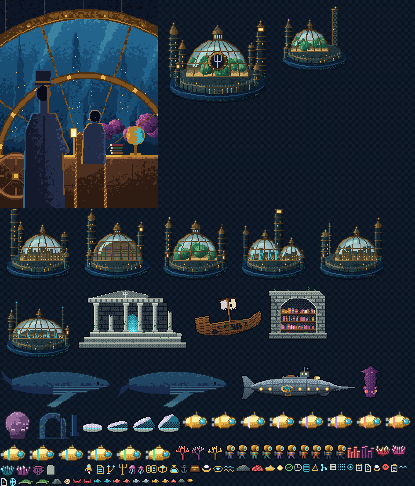

## Regenerating screenshots

Screenshots are captured headless with Playwright (WebGL via SwiftShader, so no GPU
is required):

```sh
npm install
npm run shots           # capture everything into screenshots/
npm run shots -- reef   # capture only studies matching "reef"
```

three.js is a dev dependency too: the capture serves the 3D consoles' CDN imports from
`node_modules/three`, so they render offline.

## License

[MIT](LICENSE)
